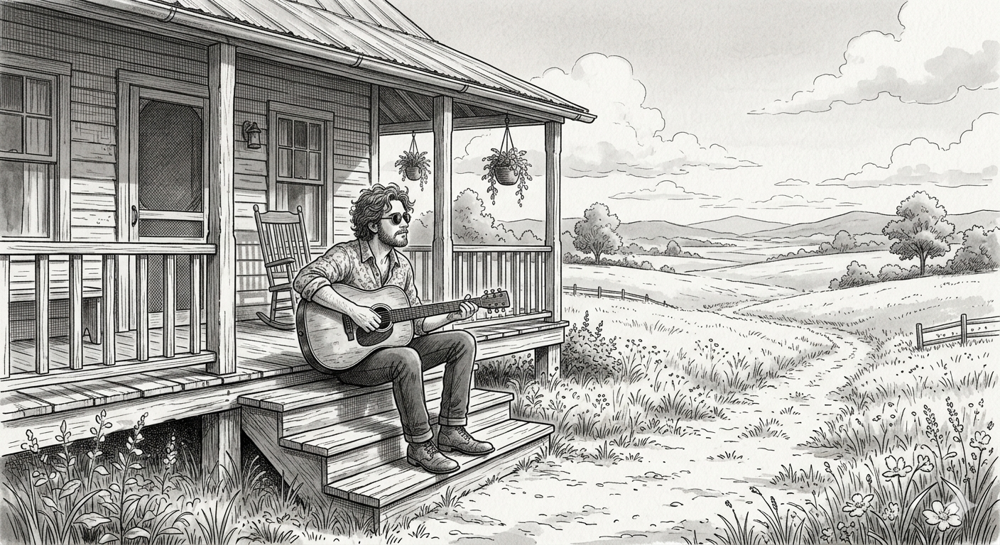
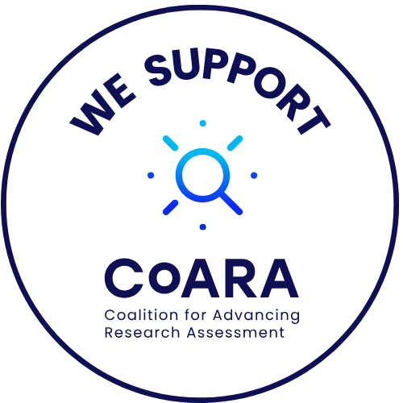

{fig-align="center" width="450"}

Here we are going to discuss two separate things.

1.  **Controlling my outputs through the use of identifiers.** We all have an ORCID, but what is it for? Here I'll provide some tips on how to use this identifier to connect it with Scopus Author ID and Researcher ID, also some very basic tips on Google Scholar Profiles.

2.  **How to present your CV.** Particularly we will focus very generally on how to present a good narrative CV, the latest trend in research assessment 🥴.

## Narrative CVs

There was a time when academic Cvs in Spain where characterised by their lack of synthesis: the longer the better. In recent years this has changed. The [**Coalition for the Reform of Research Assessment**](https://coara.eu) has now been implanted in many national research evaluation systems all over Europe and beyond.

{fig-align="center" width="153"}

Spain is one of the countries in which this has had a greater impact, with **ANECA**, **CRUE** and **CSIC** leading the reforms in Spain.

::: callout-note
Want to learn more about CoARA?

- Check out its [guiding principles](https://www.coara.org/agreement/guiding-principles/)

- Visit ANECA's [website devoted to CoARA](https://www.aneca.es/2025-espacio-coara)
:::

Among other things, this introduces too major changes on how we present ourselves to funders:

1.  **JIFs and citations are not enough.** CoARA is against the abuse of Journal Impact Factors and encourages [not to use them.]{.underline} We should add further contextual arguments when defending our papers:
    - Contribution to the field
    - Societal impact
    - Novelty
    - Funding
2.  **Narratives are welcome!** This means making the case for how and why our contributions are meaningful and contextualising them within our own research agenda.

> The main goal is to move from the traditional list-of-outputs format to narrative formats that ask you to *explain* your contributions rather than just enumerate them.

### Why the shift?

Listing publications by Journal Impact Factor rewards volume and venue over actual contribution. Narrative CVs push back against this by asking:

- What did *you* specifically contribute?
- What is the significance of this work, beyond the journal it appeared in?
- How does it connect to a coherent research trajectory?

Key readings on the debate:

- [Time to remodel the scientific CV](https://www.nature.com/articles/d41586-019-03)
- [Using narrative CVs](https://www.ukri.org/what-we-offer/developing-people-and-skills/future-leaders-fellowships/narrative-cv/) (UKRI format)

### The ANECA CVA: what it requires

Since April 2024, the CVA-ANECA (Currículum Vitae Abreviado) is **mandatory** for all accreditation applications to PTU and CU under the ACADEMIA programme. It is built through the [FECYT CVN Editor](http://cvn.fecyt.es/editor).

Key features of the CVA:

- **No page limit**, but a maximum number of contributions per section (varies by TU vs. CU)
- **Narrative fields at two levels:**
  - Global CV narrative: up to **5,000 characters**: your research trajectory as a coherent story
  - Per-contribution narrative: up to **1,500 characters** each: quality, impact, your specific role
- Includes your researcher profiles: ORCID, Scopus ID, ResearcherID, and others
- Docencia section requires either a Docentia report or a self-assessment (max. 5 pages)

::: callout-important
The CVA is **not** just an abbreviated CVN. The philosophy is different: fields that have a checkbox in the full CVN must be argued narratively in the CVA. If you fill in the full CVN and export, you will likely miss important fields. Work directly in the CVA format from the start.
:::

### Tips for writing effective narratives

1.  **Speak to the reviewer's criteria**
    - For **EARLY CAREER APPLICANTS** focus narratives on competence development, new methods or techniques introduced, and proactivity.
    - For **TITULAR**, emphasize competence acquisition and methodological contributions
    - For **CATEDRATICO**, foreground leadership and independent research lines, demonstrate leadership in research direction and management.
2.  **Be specific about your role:** "I led the design of the study and the analysis" is more convincing than "I contributed to..."
3.  **Contextualise impact without relying on JIF**: cite usage stats, policy uptake, collaborations generated, or follow-on work that cites yours
4.  **Don't undersell, don't overclaim**: reviewers are experts in the field
5.  **Career gaps and unconventional paths** must be explained clearly (this is explicitly required)

------------------------------------------------------------------------

## ORCID

[ORCID](https://orcid.org) (Open Researcher and Contributor ID) is a persistent digital identifier that distinguishes you from every other researcher. It is now **mandatory** in most EU funding calls (Horizon Europe, ERC, MSCA) and required in the ANECA CVA.

### What to do

1.  **Register** at orcid.org — free, takes 5 minutes
2.  **Make your profile public** (at least the works list)
3.  **Connect external sources**: Scopus, Web of Science, Crossref, DataCite — this auto-imports your publications
4.  **Use it consistently**: add your ORCID iD to every journal submission, grant application, and institutional profile

### What ORCID gives you

- Single persistent identifier that follows you across institutions and name changes
- Interoperability: data flows between ORCID and funding agencies, publishers, and institutional systems
- A BibTeX export of your works for use elsewhere
- Peer review tracking (via Crossref)

::: callout-tip
ORCID is the one identifier that travels with you. Scopus and Web of Science IDs are database-specific. If you only set up one thing today, make it ORCID.
:::

------------------------------------------------------------------------

## Scopus Author ID

Scopus automatically assigns an Author ID based on publication metadata. The problem: if your name appears inconsistently across papers, you may have multiple IDs, or share one with someone else.

### What to do

1.  Search for yourself at [scopus.com](https://www.scopus.com) using `author:'your name'`
2.  Check whether all your publications are under a single profile
3.  If not: use the **Author Feedback Wizard** (requires institutional access) to merge or correct profiles
4.  Add your ORCID to link both systems
5.  Check author-level metrics (h-index, citation counts, document counts) and **understand what they do and don't mean**

::: callout-note
Scopus coverage is strong in natural sciences, medicine, and social sciences, but weaker in humanities and some regional literature. Know your field's coverage before relying heavily on Scopus metrics.
:::

------------------------------------------------------------------------

## Researcher ID (Web of Science)

Web of Science has its own researcher profile system, now integrated into the [Web of Science platform](https://www.webofscience.com).

### What to do

1.  Create a profile at webofscience.com
2.  Claim your publications (use the search and add manually if needed)
3.  Review your **Beamplot** — a visualisation of your citation profile over time
4.  Link to your ORCID
5.  Log peer review activity — Web of Science tracks this and it feeds into your ORCID profile

::: callout-note
Web of Science coverage skews towards high-impact international journals. It is the database behind the *sexenios* evaluation in Spain, so keeping this profile clean matters for CNEAI applications.
:::

------------------------------------------------------------------------

## Google Scholar

Google Scholar is the most inclusive database — it indexes conference papers, theses, preprints, grey literature, and books that Scopus and WoS miss. It is also the most visible to non-specialists.

### What to do

1.  Create a [Google Scholar profile](https://scholar.google.com/citations)
2.  **Verify it** with your institutional email and make it public
3.  Set up email alerts for new citations
4.  Manage automatic updates: Scholar will suggest new papers — review them, as false positives do appear

### Caveats

- No quality control: Google Scholar can include duplicates, erroneous citations, and grey literature
- Metrics (h-index, i10-index) are inflated compared to Scopus/WoS
- Useful for visibility and self-monitoring, [complements but does not replace]{.underline} Scopus/WoS for formal evaluation in Spain

::: callout-tip
**Essential for early career researchers** who want maximum visibility, especially in fields with significant conference and preprint culture. Less critical if your field is well-covered by Scopus/WoS and your primary audience is specialists.
:::
